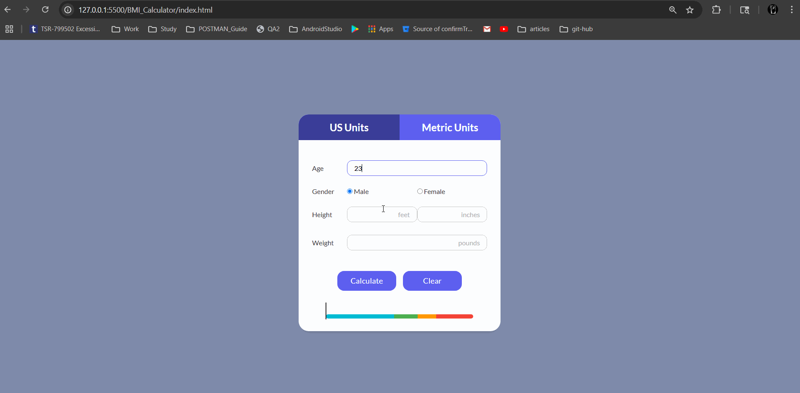

# 🧮 BMI Calculator Web App

A responsive and interactive BMI (Body Mass Index) Calculator built using **HTML**, **CSS**, and **JavaScript**. This web app allows users to calculate their BMI using either US Customary or Metric units, and visually represents the result using a color-coded gauge.

## 🌟 Features

- ✅ Toggle between **US Units** (feet, inches, pounds) and **Metric Units** (cm, kg)
- ✅ Gender-based input options (Male/Female)
- ✅ Real-time **BMI Calculation**
- ✅ Displays:
  - BMI value
  - BMI category (Underweight, Normal, Overweight, Obese)
  - Selected gender
- ✅ **Gauge Bar** visualization to show BMI range position
- ✅ Input validation with error alerting
- ✅ Reset button to clear all fields and outputs
- ✅ Responsive design for mobile and desktop

| US Units    | Metric Units    | Gauge Visualization |
| ----------- | --------------- | ------------------- |
| ![US Units] | ![Metric Units] | ![Gauge]            |

## 🔧 Technologies Used

- **HTML5** – Structure and semantics
- **CSS3** – Layout and styling
- **JavaScript (Vanilla)** – Interactivity, logic, DOM manipulation

## 🚀 Getting Started

### 📁 Clone the Repository

```bash
git clone https://github.com/yourusername/bmi-calculator-app.git
cd bmi-calculator-app
```

### 💻 Open in Browser

Open `index.html` with your preferred browser:

```bash
start index.html  # Windows
open index.html   # macOS
```

Alternatively, right-click `index.html` and select **Open with browser**.

## 📂 Project Structure

```
bmi-calculator-app/
├── index.html        # Main HTML file
├── styles.css        # CSS file for styling
├── script.js         # JavaScript logic
├── README.md         # Project README
└── screenshots/      # (Optional) App screenshots
```

## Walkthrough



## 📬 Contact

If you have any suggestions or feedback, feel free to connect!

- 🌐 [LinkedIn](https://linkedin.com/in/your-profile)
- 🐙 [GitHub](https://github.com/pranavasree)

---

### 📝 License

This project is create with ❤️ and open-source.
