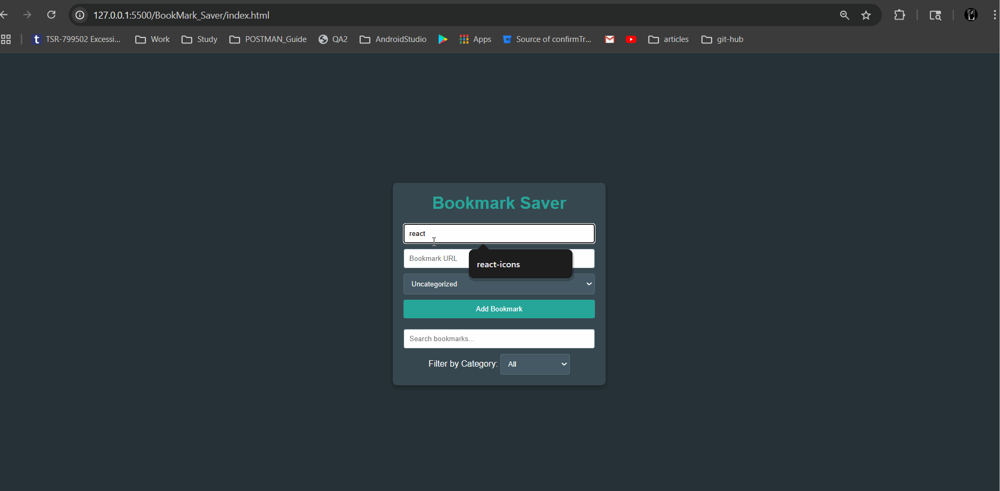

# Bookmark Saver

Bookmark Saver is a lightweight web application that enables users to save, view, and remove bookmarks directly in their browser. Built using vanilla HTML, CSS, and JavaScript, it leverages localStorage for persistent data storage across sessions. The app features a modern dark-themed interface with responsive design, ensuring usability across desktops, tablets, and mobile devices.



## Features

- **Add Bookmarks**: Save bookmarks by providing a name and a valid URL (must start with `http://` or `https://`).
- **Remove Bookmarks**: Delete bookmarks with a single click.
- **Persistent Storage**: Bookmarks are stored in the browser’s localStorage, persisting even after the browser is closed.
- **Responsive Design**: The UI adapts seamlessly to different screen sizes:
  - Mobile (≤600px): Compact layout with stacked buttons and touch-friendly sizes.
  - Tablet (601px–768px): Wider container with enhanced readability.
  - Desktop (>768px): Centered layout with a max-width of 400px or 90% of viewport.
- **Dark Theme**: A sleek dark theme with teal and red-orange accents for improved readability.
- **Edit Bookmarks**: Add functionality to edit existing bookmark names and URLs.
- **Bookmark Categories**: Enable assigning categories (e.g., Work, Personal, Study) and filtering by category.
- **Search Bookmarks**: Implement a search input to filter bookmarks by name or URL.

_Note_: Additional features like editing, categorizing, or searching bookmarks can be implemented. See the "Future Enhancements" section for details.

## Project Structure

## Setup

1. **Clone or Download**:

   - Clone this repository or download the project files to your local machine.

2. **Serve the App**:

   - The app uses localStorage, requiring it to be served over a local server (not opened directly as a file).
   - Install a local server, such as `live-server`:
     ```bash
     npm install -g live-server
     ```
   - Navigate to the project folder and run:
     ```bash
     live-server
     ```
   - The app will open in your default browser at `http://localhost:8080`.

3. **Requirements**:
   - A modern web browser (e.g., Chrome, Firefox, Edge).
   - No external dependencies or backend server required.

## Usage

1. **Add a Bookmark**:

   - Enter a name in the "Bookmark Name" input field.
   - Enter a valid URL (e.g., `https://example.com`) in the "Bookmark URL" input field.
   - Click the "Add Bookmark" button to save.
   - Alerts will appear if the name or URL is missing or if the URL doesn’t start with `http://` or `https://`.

2. **View Bookmarks**:

   - Saved bookmarks appear in a list below the input form.
   - Click a bookmark’s name to open the URL in a new browser tab.

3. **Remove a Bookmark**:

   - Click the "Remove" button next to a bookmark to delete it from the list and localStorage.

4. **Responsive Experience**:
   - On mobile devices, the layout adjusts with smaller padding, scalable fonts, and vertically stacked buttons for easy touch interaction.
   - On tablets, the container expands to use more screen space with slightly larger fonts.
   - On desktops, the app maintains a centered, compact layout with a clean design.

## Responsive Design

The app is optimized for cross-device compatibility:

- **Mobile (≤600px)**: Reduced padding, stacked list buttons, and touch-friendly sizes (minimum 44px for buttons) ensure usability.
- **Tablet (601px–768px)**: Wider container and larger fonts enhance readability.
- **Desktop (>768px)**: Fixed max-width layout with scalable fonts and a polished dark theme.
- **Accessibility**: Uses `clamp()` for dynamic font sizing and ellipsis for long bookmark names to prevent text overflow.

## Future Enhancements

- **Edit Bookmarks**: Add functionality to edit existing bookmark names and URLs.
- **Bookmark Categories**: Enable assigning categories (e.g., Work, Personal, Study) and filtering by category.
- **Search Bookmarks**: Implement a search input to filter bookmarks by name or URL.
- **Favicon Display**: Display website favicons next to each bookmark for visual recognition.
- **Export/Import Bookmarks**: Allow users to export bookmarks as a JSON file and import them.
- **React Conversion**: Rewrite the app in React to practice components, state management, and hooks.

## Contributing

Contributions are welcome! Feel free to fork this repository, add features, or improve the design. Submit pull requests or open issues for suggestions or bug reports.

## License

This project is open-source and available under the [MIT License](https://opensource.org/licenses/MIT).

---

_Created on June 21, 2025_

## Setup

1. **Clone or Download**:

   - Clone this repository or download the project files to your local machine.

2. **Serve the App**:

   - The app uses localStorage, requiring it to be served over a local server (not opened directly as a file).
   - Install a local server, such as `live-server`:
     ```bash
     npm install -g live-server
     ```
   - Navigate to the project folder and run:
     ```bash
     live-server
     ```
   - The app will open in your default browser at `http://localhost:8080`.

3. **Requirements**:
   - A modern web browser (e.g., Chrome, Firefox, Edge).
   - No external dependencies or backend server required.

## Usage

1. **Add a Bookmark**:

   - Enter a name in the "Bookmark Name" input field.
   - Enter a valid URL (e.g., `https://example.com`) in the "Bookmark URL" input field.
   - Click the "Add Bookmark" button to save.
   - Alerts will appear if the name or URL is missing or if the URL doesn’t start with `http://` or `https://`.

2. **View Bookmarks**:

   - Saved bookmarks appear in a list below the input form.
   - Click a bookmark’s name to open the URL in a new browser tab.

3. **Remove a Bookmark**:

   - Click the "Remove" button next to a bookmark to delete it from the list and localStorage.

4. **Responsive Experience**:
   - On mobile devices, the layout adjusts with smaller padding, scalable fonts, and vertically stacked buttons for easy touch interaction.
   - On tablets, the container expands to use more screen space with slightly larger fonts.
   - On desktops, the app maintains a centered, compact layout with a clean design.

## Responsive Design

The app is optimized for cross-device compatibility:

- **Mobile (≤600px)**: Reduced padding, stacked list buttons, and touch-friendly sizes (minimum 44px for buttons) ensure usability.
- **Tablet (601px–768px)**: Wider container and larger fonts enhance readability.
- **Desktop (>768px)**: Fixed max-width layout with scalable fonts and a polished dark theme.
- **Accessibility**: Uses `clamp()` for dynamic font sizing and ellipsis for long bookmark names to prevent text overflow.

## Contributing

Contributions are welcome! Feel free to fork this repository, add features, or improve the design. Submit pull requests or open issues for suggestions or bug reports.

## License

This project is open-source and available under the [MIT License](https://opensource.org/licenses/MIT).

---

_Created on June 21, 2025_
