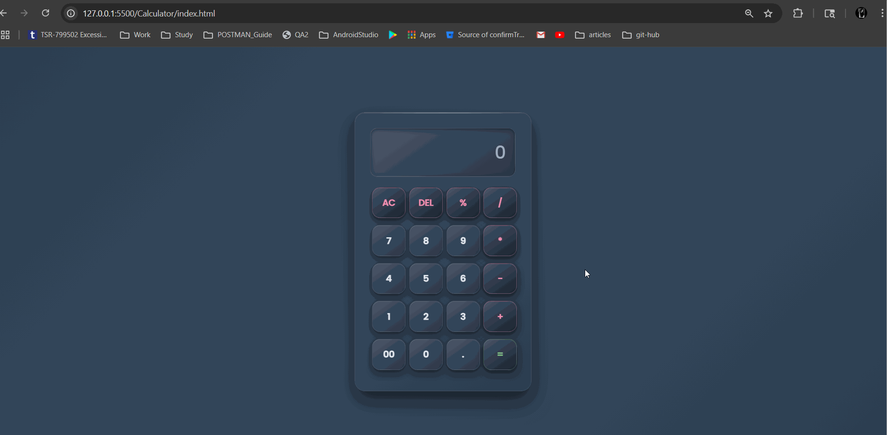

# 🧮 Professional Dark Calculator

A modern, responsive calculator web application with a sleek dark theme and professional styling. Built with HTML, CSS, and JavaScript, featuring a glass-morphism design and smooth animations.



## ✨ Features

### 🎨 **Design & UI**

- **Dark Professional Theme** - Sophisticated dark color palette with muted accents
- **Glass Morphism Effect** - Modern translucent card design with backdrop blur
- **Responsive Layout** - Adapts perfectly to all screen sizes (mobile, tablet, desktop)
- **Smooth Animations** - Elegant hover effects and button interactions
- **Professional Typography** - Clean Poppins font with scalable text

### 🔧 **Functionality**

- **Basic Arithmetic Operations** - Addition, subtraction, multiplication, division
- **Clear Functions** - AC (All Clear) and DEL (Delete last entry)
- **Percentage Calculations** - Built-in percentage operator
- **Decimal Support** - Handle decimal numbers and calculations
- **Keyboard Support** - Use keyboard for input (numbers and operators)

### 📱 **Responsive Features**

- **Mobile-First Design** - Optimized for touch devices
- **Flexible Grid Layout** - CSS Grid for perfect button alignment
- **Scalable Typography** - Text size adapts to screen size using clamp()
- **Touch-Friendly** - Proper touch targets and feedback
- **Cross-Device Compatibility** - Works on phones, tablets, and desktops

## 🚀 Getting Started

### Prerequisites

- Modern web browser (Chrome, Firefox, Safari, Edge)
- No additional dependencies required

### Installation

1. **Clone or Download** the project files
2. **Open** `index.html` in your web browser
3. **Start calculating!**

```bash
# If using Git
git clone [your-repo-url]
cd Calculator

# Open in browser
open index.html
# or
double-click index.html
```

## 📁 Project Structure

```
Calculator/
├── index.html          # Main HTML structure
├── styles.css          # All styling and responsive design
├── script.js           # Calculator functionality
└── README.md           # This documentation
```

## 🎯 Usage

### Basic Operations

- **Numbers**: Click number buttons or use keyboard (0-9)
- **Operators**: Click +, -, \*, / buttons or use keyboard
- **Equals**: Click = button or press Enter
- **Clear All**: Click AC button or press Escape
- **Delete**: Click DEL button or press Backspace
- **Decimal**: Click . button or press period key

### Keyboard Shortcuts

| Key         | Function          |
| ----------- | ----------------- |
| `0-9`       | Number input      |
| `+`         | Addition          |
| `-`         | Subtraction       |
| `*`         | Multiplication    |
| `/`         | Division          |
| `%`         | Percentage        |
| `.`         | Decimal point     |
| `Enter`     | Calculate result  |
| `Escape`    | Clear all         |
| `Backspace` | Delete last entry |

## 🎨 Color Palette

### Dark Theme Colors

- **Background**: `#2c3e50` → `#34495e` (Slate gradient)
- **Card**: `#3a4a5c` → `#2c3e50` (Dark slate gradient)
- **Display**: `#4a5568` → `#2d3748` (Input background)
- **Text**: `#e2e8f0` (Light gray)
- **Accent Green**: `#81c784` (Equals button)
- **Accent Pink**: `#f48fb1` (Operator buttons)

## 📱 Responsive Breakpoints

- **Mobile**: ≤ 480px - Optimized for phones
- **Small Mobile**: ≤ 320px - Older/smaller devices
- **Tablet+**: ≥ 768px - Enhanced spacing for larger screens
- **Desktop**: Default - Full feature set

## 🛠️ Technical Details

### Technologies Used

- **HTML5** - Semantic structure
- **CSS3** - Modern styling with Grid, Flexbox, and animations
- **JavaScript** - Calculator logic and DOM manipulation

### CSS Features

- CSS Grid for button layout
- Flexbox for centering
- CSS Custom Properties (variables)
- Media queries for responsiveness
- CSS clamp() for fluid typography
- Advanced box-shadows and gradients

### Browser Support

- ✅ Chrome 60+
- ✅ Firefox 60+
- ✅ Safari 12+
- ✅ Edge 79+

## 🔧 Customization

### Changing Colors

Edit the CSS variables in `styles.css`:

```css
/* Example: Change to blue theme */
.calculator {
  background: linear-gradient(145deg, #3498db, #2980b9);
}
```

### Modifying Layout

Adjust the grid layout:

```css
.calculator > div {
  grid-template-columns: repeat(4, 1fr); /* 4 columns */
  gap: 8px; /* Button spacing */
}
```

## 🤝 Contributing

1. Fork the project
2. Create your feature branch (`git checkout -b feature/AmazingFeature`)
3. Commit your changes (`git commit -m 'Add some AmazingFeature'`)
4. Push to the branch (`git push origin feature/AmazingFeature`)
5. Open a Pull Request

## 📄 License

This project is open source and available under the [MIT License](LICENSE).

- Professional calculator with modern design principles
- Focus on user experience and accessibility

## 🙏 Acknowledgments

- **Poppins Font** - Google Fonts
- **Design Inspiration** - Modern calculator apps
- **Color Palette** - Professional dark theme standards

---

_Built with ❤️ for modern web experiences_
