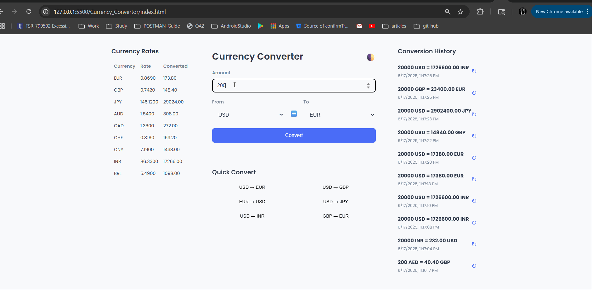

# Currency Converter App

A modern, responsive currency converter web application with real-time exchange rates, conversion history, and a clean user interface.



## Features

- **Three-Column Layout**:
  - Left Column: Currency rates table showing major currencies
  - Middle Column: Main converter with form, result, and quick convert options
  - Right Column: Conversion history
- **Real-time Currency Conversion**: Convert between different currencies using up-to-date exchange rates
- **Quick Convert**: Easily convert between common currency pairs with a single click
- **Conversion History**: Track your recent conversions with the ability to repeat them
- **Dark/Light Mode**: Toggle between dark and light themes with persistent preference
- **Responsive Design**: Works on desktop, tablet, and mobile devices
- **Offline Support**: Service worker implementation for offline functionality

## Technologies Used

- HTML5
- CSS3 (with CSS Grid and Flexbox for layout)
- JavaScript (ES6+)
- Fetch API for currency data
- LocalStorage for saving history and preferences
- Service Worker for offline capabilities

## API

This application uses the [ExchangeRate-API](https://www.exchangerate-api.com/) to fetch real-time currency exchange rates.

## Getting Started

### Prerequisites

- A modern web browser (Chrome, Firefox, Safari, Edge)
- Internet connection (for initial load and rate updates)

### Installation

1. Clone the repository:

   ```
   git clone https://github.com/yourusername/currency-converter.git
   ```

2. Navigate to the project directory:

   ```
   cd currency-converter
   ```

3. Open `index.html` in your browser or use a local server:

   ```
   # Using Python
   python -m http.server

   # Using Node.js
   npx serve
   ```

## Usage

1. Enter the amount you want to convert
2. Select the source currency from the "From" dropdown
3. Select the target currency from the "To" dropdown
4. Click "Convert" to see the result
5. Use the swap button (↔️) to quickly switch between currencies
6. Click on any quick convert pair for common conversions
7. View your conversion history on the right side
8. Toggle between dark and light mode using the theme button (🌓)

## Project Structure

```
currency-converter/
├── index.html          # Main HTML structure
├── style.css           # Styling and responsive design
├── script.js           # Application logic and API calls
├── service-worker.js   # Offline functionality
└── README.md           # Project documentation
```

## Customization

### Adding More Currency Pairs

To add more quick convert currency pairs, modify the `commonPairs` array in `script.js`:

```javascript
const commonPairs = [
  { from: "USD", to: "EUR" },
  { from: "USD", to: "GBP" },
  // Add more pairs here
];
```

### Changing Default Currencies

To change the default currencies, modify the following lines in the `fetchCurrencies` function:

```javascript
// Set default values
fromCurrency.value = "USD"; // Change to your preferred default
toCurrency.value = "EUR"; // Change to your preferred default
```

## Browser Support

- Chrome (latest)
- Firefox (latest)
- Safari (latest)
- Edge (latest)
- Opera (latest)

## License

This project is licensed under the MIT License.

## Acknowledgments

- [ExchangeRate-API](https://www.exchangerate-api.com/) for providing free currency exchange rates
- [Google Fonts](https://fonts.google.com/) for the Poppins font family
