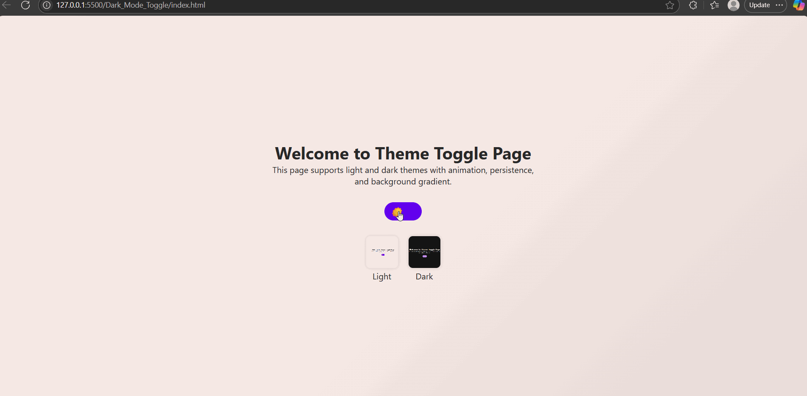

# Responsive Theme Toggle Web App

A modern, responsive web application with Light/Dark theme toggle and enhanced UI features.

## 🚀 Features

- 🌗 Light/Dark Mode Toggle with animated icons (☀️ / 🌙)
- 💾 Persistent Theme using `localStorage`
- 🖥️ System Preference Detection (`prefers-color-scheme`)
- ⏱️ Auto Theme Toggle Based on Time (Dark after 6 PM)
- 🧠 Theme Preview Thumbnails (Click to activate theme)
- 🌈 Animated Background Gradient with smooth transitions
- 🔄 Smooth fade animation on theme change
- 🌐 Responsive Design for all screen sizes
- 📇 Dynamic Favicon Switching

## 📂 File Structure

```
theme-toggle-app/
├── index.html
├── style.css
├── script.js
├── favicon-light.ico
├── favicon-dark.ico
├── light.png
└── dark.png
```

## 🛠️ Setup

1. Clone or download the repository.
2. Place your favicon and preview images in the root directory.
3. Open `index.html` in any modern browser.

## 🖼️ Assets

- `favicon-light.ico`: Favicon for Light Theme
- `favicon-dark.ico`: Favicon for Dark Theme
- `light.png`: Thumbnail for Light Mode
- `dark.png`: Thumbnail for Dark Mode

## 📸 Preview

> A sleek UI that smoothly transitions between vibrant light and soft dark themes, complete with preview and animated effects.
> 

## 📜 License

This project is licensed under the MIT License.
