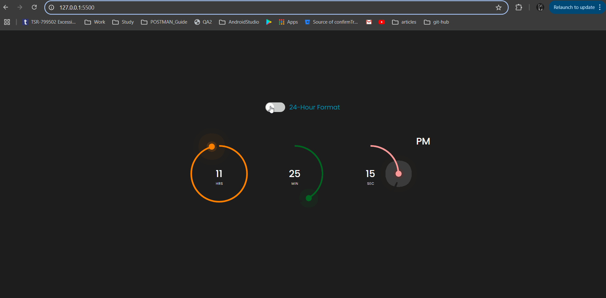

# Digital Clock with 12/24 Hour Toggle

This is a digital clock web application that displays the current time using animated circular progress indicators for hours, minutes, and seconds. It includes a toggle button to switch between 12-hour and 24-hour time formats.

## Features

- Real-time digital clock using JavaScript
- Circular progress indicators for hours, minutes, and seconds
- Toggle between 12-hour and 24-hour time formats
- Responsive and modern UI design

## Technologies Used

- HTML5
- CSS3
- JavaScript

## Usage

1. Open `index.html` in a web browser.
2. The clock will display the current time with circular animations.
3. Use the **Toggle Format** button to switch between 12-hour and 24-hour modes.

## Folder Structure

```
digital-clock/
├── index.html
├── styles.css
├── script.js
└── README.md
```

## Preview



## License

This project is open-source and free to use.
