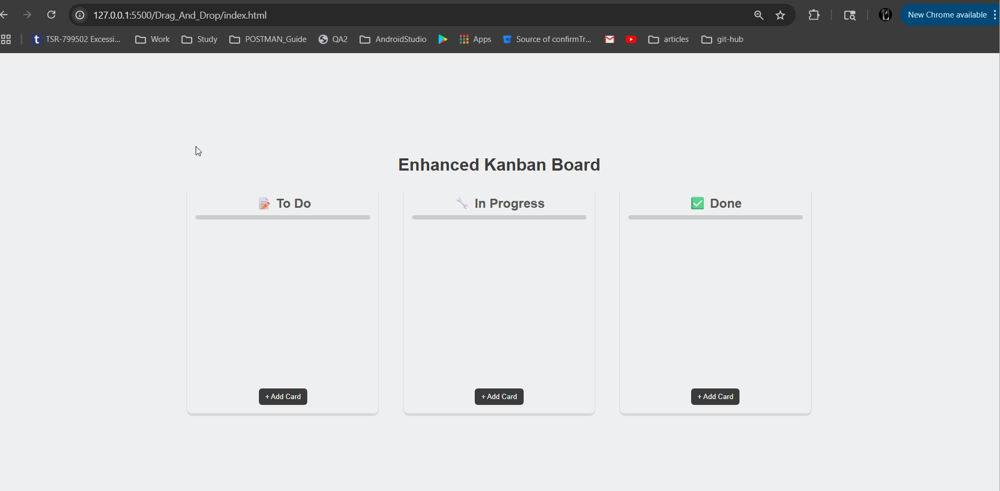

# 🗂️ Sticky Note Kanban Board

A colorful, sticky-note inspired Kanban board built using **HTML**, **CSS**, and **JavaScript** with the following interactive and persistent features:

---

## ✨ Features

### ✅ Basic Kanban Functionality

- Drag and drop cards between **To Do**, **In Progress**, and **Done** columns.
- Each card is draggable and editable.

### 📝 Add & Edit Tasks

- Add new tasks to any list using **"+ Add Card"** buttons.
- Click into a card’s text field to rename it.

### ❌ Delete Tasks

- Click the red **❌ icon** to remove a task from any list.

### 💾 Persistent Storage

- Board state is automatically saved to **LocalStorage**.
- Reloading the page retains all cards and lists.

### 🎨 Sticky Note Design

- Cards styled to look like **sticky notes**:
  - Tilted layout
  - Soft pastel colors
  - Red pin-dot at top
- Multiple random color variations to mimic physical sticky notes.

### 📊 Progress Bar

- **Dynamic progress bar** for the "Done" column.
- Progress fills proportionally as cards move into "Done".

---

## 📷 Preview



---

## 🛠 Technologies Used

- HTML5
- CSS3 (Responsive + Styled Sticky Notes)
- JavaScript (DOM Manipulation + LocalStorage)

---

## 🚀 Getting Started

1. Clone or download the repository.
2. Open `index.html` in any browser.
3. Start organizing your tasks!

---

## 📁 Project Structure

```
/kanban-sticky-board
│
├── index.html        # Main HTML file
├── style.css         # All styling, including sticky note design
├── script.js         # Drag-and-drop logic + localStorage + progress
└── preview.png       # Preview image
```

---

## 🙌 Acknowledgments

Inspired by physical sticky note task boards and the need for a minimalist, fun task tracker.

---

## 📌 Author

Developed with ❤️ by Pranava Sree Pottipati
