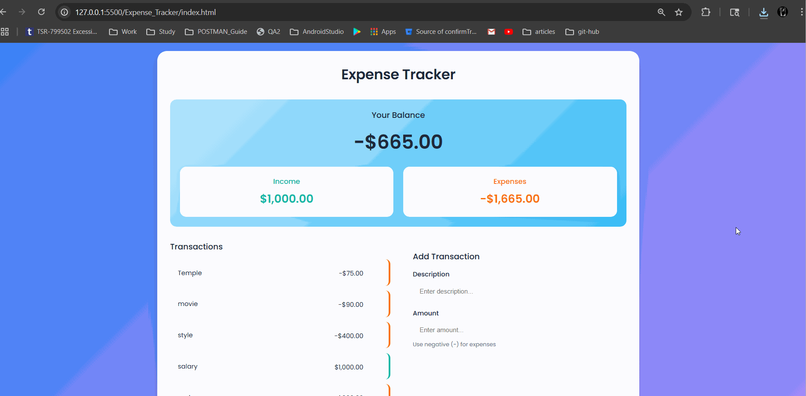

# Expense Tracker App

## Overview

The Expense Tracker is a web-based application built with HTML, CSS, and JavaScript to help users manage their income and expenses. It features a modern, responsive UI with light and dark mode support, allowing users to track transactions, set budgets, visualize spending, and export data. The app is designed for ease of use and accessibility, with a clean interface and intuitive controls.

## Features

The app includes the following features:

1. **Category Tagging**: Assign categories (e.g., Food, Salary) to transactions for organized tracking.
2. **Filtering and Sorting**: Filter transactions by type (income/expense) or category, and sort by date or amount.
3. **CSV Export**: Download transaction data as a CSV file for external use.
4. **Budget Goal**: Set a budget goal and track spending progress with a visual progress bar.
5. **Date Input**: Add transactions with specific dates for accurate record-keeping.
6. **Dark Mode**: Toggle between light and dark themes for better visibility and user preference.
7. **Search**: Search transactions by description or category for quick access.
8. **Charts**: Visualize income and expenses with a pie chart using Chart.js.

## File Structure

- `index.html`: The main HTML file defining the app's structure, including the form, transaction list, summary, and chart.
- `style.css`: Contains all styling, including responsive design, dark mode, and UI enhancements like gradients and centered income/expense sections.
- `script.js`: Handles app logic, including transaction management, filtering, sorting, CSV export, budget tracking, and chart rendering.

## Setup Instructions

To run the Expense Tracker locally, follow these steps:

1. **Clone or Download the Project**:

   - Download the project files (`index.html`, `style.css`, `script.js`) or clone the repository.
   - Ensure all files are in the same directory.

2. **Dependencies**:

   - The app uses [Chart.js](https://www.chartjs.org/) for charts, loaded via CDN in `index.html`:
     ```html
     <script src="https://cdn.jsdelivr.net/npm/chart.js"></script>
     ```
   - No additional installations are required, as the app runs entirely in the browser.

3. **Run the App**:

   - Open `index.html` in a modern web browser (e.g., Chrome, Firefox, Edge).
   - Alternatively, serve the files using a local server (e.g., via VS Code's Live Server extension or a simple HTTP server like `python -m http.server`).

4. **Browser Compatibility**:
   - The app is tested on modern browsers with support for ES6 JavaScript, CSS Grid, and Flexbox.

## Usage Instructions

1. **Adding Transactions**:

   - Use the form on the right to input transaction details (description, amount, category, date, type).
   - Click the "Add Transaction" button to save. Transactions appear in the list on the left.

2. **Filtering and Sorting**:

   - Use the dropdowns in the transaction list header to filter by type (All, Income, Expense) or category.
   - Sort transactions by date or amount using the sort dropdown.

3. **Exporting to CSV**:

   - Click the "Export CSV" button in the transaction list header to download a CSV file of all transactions.

4. **Setting a Budget**:

   - Enter a budget goal in the "Budget" input field under the balance section.
   - The progress bar updates to show spending relative to the budget.

5. **Dark Mode**:

   - Toggle dark mode using the switch in the top-right corner of the header.
   - Dark mode uses high-contrast colors (e.g., `#e5e7eb` for text, `#1f2937` for backgrounds) for readability.

6. **Searching Transactions**:

   - Enter keywords in the search input in the transaction list header to filter transactions by description or category.

7. **Viewing Charts**:

   - The pie chart in the summary section (right column) displays income vs. expense distribution.
   - The chart updates automatically as transactions are added or removed.

8. **Transaction List**:
   - The transaction list is scrollable if there are many transactions, with a maximum height of 400px (300px on screens <900px, 250px on screens <480px).
   - Each transaction shows description, amount, category, date, and a delete button (visible on hover).

## UI Highlights

- **Responsive Design**: Adapts to various screen sizes, with breakpoints at 900px and 480px for optimal layout on mobile and desktop.
- **Centered Income/Expenses**: The Income and Expenses sections in the summary are centered vertically and horizontally for a balanced look.
- **Transaction List Scrollbar**: The transaction list has a fixed maximum height with a custom scrollbar, ensuring it doesn't overflow its container.
- **Consistent Styling**: The transaction list and form use matching light purple gradients (`#f5f3ff` to `#ede9fe` in light mode, `#312e81` to `#4c1d95` in dark mode).
- **Dark Mode**: Ensures all text (e.g., headers, labels, categories) is visible with high-contrast colors (`#e5e7eb`, `#d1d5db`).

## Screenshots



## License

This project is licensed under the MIT License. Feel free to use, modify, and distribute the code as needed.

## Contact

For questions or contributions, contact pranavareddy27@gmail.com
