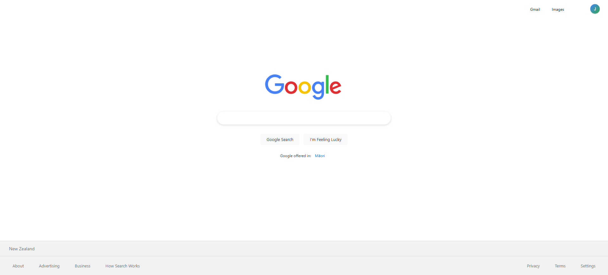

# 🔍 Google Clone

A pixel-perfect, responsive replica of Google's homepage built with modern web technologies. Features clean design, smooth animations, and full functionality including search capabilities.

  

## ✨ Features

### 🎨 **Design & UI**

- **Pixel-Perfect Design** - Accurate replica of Google's current homepage
- **Modern Styling** - Clean, professional appearance with Google's color palette
- **Smooth Animations** - Subtle hover effects and transitions
- **Responsive Layout** - Adapts seamlessly to all screen sizes
- **Professional Typography** - System fonts for native, crisp appearance

### 🔧 **Functionality**

- **Google Search** - Direct integration with Google's search engine
- **I'm Feeling Lucky** - Quick access to Google's lucky search
- **Voice Search Button** - UI element for voice search (placeholder)
- **Image Search Button** - UI element for image search (placeholder)
- **Auto-Focus** - Search input automatically focused on page load
- **Keyboard Shortcuts** - Enhanced user experience with keyboard navigation

### 📱 **Responsive Features**

- **Mobile-First Design** - Optimized for touch devices
- **Flexible Grid Layout** - Perfect alignment across all screen sizes
- **Touch-Friendly** - Proper button sizes and spacing for mobile
- **Cross-Device Compatibility** - Works flawlessly on phones, tablets, and desktops

### ♿ **Accessibility**

- **Semantic HTML** - Proper landmarks and structure
- **ARIA Labels** - Screen reader friendly
- **Keyboard Navigation** - Full keyboard accessibility
- **Focus Management** - Clear focus indicators

## 🚀 Getting Started

### Prerequisites

- Modern web browser (Chrome, Firefox, Safari, Edge)
- No additional dependencies required

### Installation

1. **Clone or Download** the project files
2. **Open** `index.html` in your web browser
3. **Start searching!**

```bash
# If using Git
git clone [your-repo-url]
cd Google_Clone

# Open in browser
open index.html
# or
double-click index.html
```

## 📁 Project Structure

```
Google_Clone/
├── index.html          # Main HTML structure
├── style.css           # All styling and responsive design
├── script.js           # Search functionality and interactions
├── images/             # Logo and favicon assets
│   ├── logo.jpg        # Google logo
│   └── favicon.jpg     # Browser favicon
└── README.md           # This documentation
```

## 🎯 Usage

### Search Functions

- **Type & Enter**: Enter search query and press Enter or click "Google Search"
- **I'm Feeling Lucky**: Click to go directly to the first search result
- **Voice Search**: Click microphone icon (placeholder functionality)
- **Image Search**: Click camera icon (placeholder functionality)

### Keyboard Shortcuts

| Key                 | Function                  |
| ------------------- | ------------------------- |
| `Any letter/number` | Auto-focus search input   |
| `Enter`             | Perform Google search     |
| `Escape`            | Clear search input        |
| `Tab`               | Navigate through elements |

### Navigation Links

- **Gmail**: Links to Gmail
- **Images**: Links to Google Images
- **Apps Menu**: Google apps menu (placeholder)
- **User Account**: User profile access (placeholder)

## 🎨 Design Details

### Color Palette

- **Background**: `#ffffff` (Pure white)
- **Text Primary**: `#202124` (Dark gray)
- **Text Secondary**: `#70757a` (Medium gray)
- **Links**: `#1a73e8` (Google blue)
- **Borders**: `#dfe1e5` (Light gray)
- **Hover**: `rgba(60, 64, 67, 0.08)` (Subtle gray)

### Typography

- **Font Family**: System fonts (-apple-system, BlinkMacSystemFont, Segoe UI, Roboto)
- **Search Input**: 16px for optimal mobile experience
- **Navigation**: 13px for clean, compact appearance
- **Buttons**: 14px for readability

## 📱 Responsive Breakpoints

- **Desktop**: Default - Full feature set
- **Tablet**: ≤ 768px - Optimized spacing and layout
- **Mobile**: ≤ 480px - Touch-optimized interface
- **Small Mobile**: ≤ 320px - Compact layout for older devices

## 🛠️ Technical Details

### Technologies Used

- **HTML5** - Semantic structure with accessibility features
- **CSS3** - Modern styling with Flexbox and responsive design
- **JavaScript (ES6+)** - Search functionality and user interactions
- **Font Awesome** - Icons for search, voice, and navigation

### Browser Support

- ✅ Chrome 60+
- ✅ Firefox 60+
- ✅ Safari 12+
- ✅ Edge 79+

### Performance Features

- Optimized CSS selectors
- Efficient JavaScript event handling
- Minimal external dependencies
- Fast loading times

## 🔧 Customization

### Changing Colors

Edit the CSS custom properties:

```css
/* Example: Dark theme */
body {
  background-color: #1a1a1a;
  color: #e8eaed;
}
```

### Modifying Layout

Adjust responsive breakpoints:

```css
@media screen and (max-width: 768px) {
  /* Your custom mobile styles */
}
```

### Adding Features

Extend JavaScript functionality:

```javascript
// Example: Add search suggestions
function addSearchSuggestions() {
  // Implementation here
}
```

## 🌟 Features Showcase

### Search Functionality

- Real Google search integration
- Form validation and error handling
- Multiple search types (regular and lucky)
- Clean URL encoding for special characters

### User Experience

- Auto-focus on page load
- Smooth hover animations
- Responsive button states
- Keyboard accessibility

### Code Quality

- Semantic HTML structure
- Modular CSS organization
- Clean JavaScript architecture
- Comprehensive error handling

## 🤝 Contributing

1. Fork the project
2. Create your feature branch (`git checkout -b feature/AmazingFeature`)
3. Commit your changes (`git commit -m 'Add some AmazingFeature'`)
4. Push to the branch (`git push origin feature/AmazingFeature`)
5. Open a Pull Request

## 📄 License

This project is open source and available under the [MIT License](LICENSE).

## 👨‍💻 Author

**Professional Google Clone**

- Pixel-perfect design replication
- Modern web development practices
- Focus on accessibility and user experience

## 🙏 Acknowledgments

- **Google** - Original design inspiration
- **Font Awesome** - Icon library
- **Modern Web Standards** - HTML5, CSS3, ES6+

---

_Built with ❤️ for learning and demonstration purposes_
