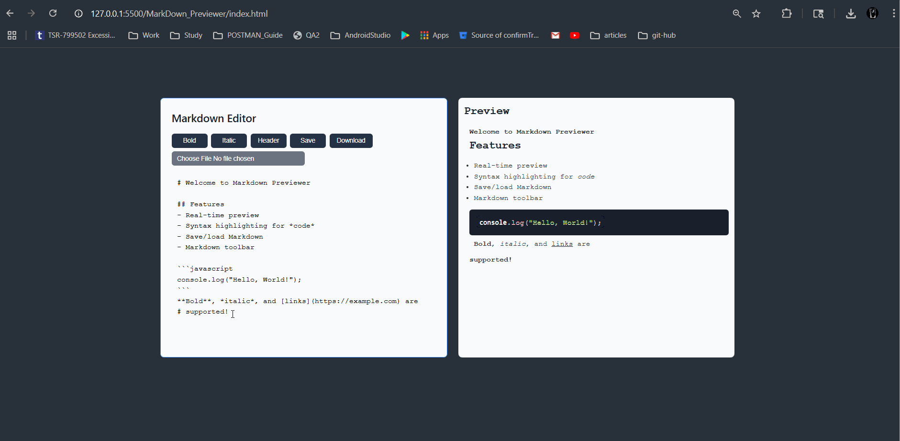

# Markdown Previewer App README

## Overview

This document provides an overview and instructions for the Markdown Previewer App, a web-based tool designed to write and preview Markdown content in real-time. The app is ideal for developers, writers, and content creators, offering a modern interface with essential features.

## Features

- Real-time Markdown preview with syntax highlighting.
- Toolbar for quick insertion of Markdown syntax (bold, italic, headers).
- Save and load Markdown content using localStorage or file import/export.
- Responsive design with a modern, customizable interface.
- Dark mode toggle for better visibility and user preference.

## Installation

1. Ensure you have a modern web browser (e.g., Chrome, Firefox, Edge).
2. Download the app files: `index.html`, `styles.css`, and `script.js`.
3. Add the following CDN links to `index.html` within the `<head>` tag:
   - ``
   - ``
   - `<link href="https://cdnjs.cloudflare.com/ajax/libs/prism/1.25.0/themes/prism.min.css" rel="stylesheet" />`
   - `<link href="https://fonts.googleapis.com/css2?family=Poppins&display=swap" rel="stylesheet">`
4. Open `index.html` in a web browser to start using the app.

## Usage

1. Open the app in a web browser.
2. Type or paste Markdown text in the editor panel on the left.
3. View the real-time preview on the right panel.
4. Use the toolbar buttons to insert Markdown syntax or manage files (save, download, load).
5. Customize the experience by adjusting the interface as needed.

## Contribution

Contributions are welcome! To contribute:

- Fork the repository (if hosted) or download the source files.
- Make improvements (e.g., new features, bug fixes).
- Test changes in a local environment.
- Submit a pull request or share updated files with the maintainer.

## Last Updated

Sunday, June 22, 2025
