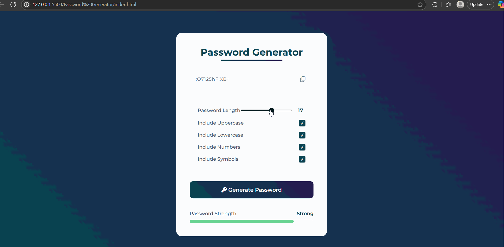

# 🔐 Password Generator App

A sleek, secure, and user-friendly Password Generator built with **HTML**, **CSS**, and **JavaScript**, featuring a modern **glassmorphic design**.

## ✨ Features

- 🎨 **Glassmorphic UI**: Modern and elegant design with soft shadows and translucent panels.
- 🔢 **Customizable Password Length**: Choose between 6–24 characters.
- 🔠 **Character Set Options**:
  - Include Uppercase
  - Include Lowercase
  - Include Numbers
  - Include Symbols
- 📋 **Copy to Clipboard**: Instantly copy the generated password.
- 📊 **Password Strength Meter**:
  - Dynamically analyzes password based on character diversity and length.
  - Visually represents strength with color-coded progress bar.
- 🔄 **Auto Password Generation** on page load.
- ✅ **Accessibility-Friendly** and Responsive Layout.

## 🚀 Getting Started

Clone this repo and open `index.html` in your browser:

```bash
git clone <your-repo-url>
cd password-generator
open index.html
```

## 📁 File Structure

- `index.html` – Main structure of the app
- `styles.css` – Custom styling and design
- `script.js` – Password generation and interactivity

---

### 📸 Preview



## 💡 Author

Crafted with 💚 by Pranava Sree Pottipati
