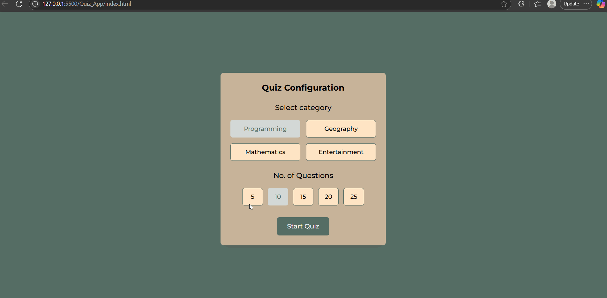

# Quiz App

A responsive, customizable quiz application built using **HTML**, **CSS**, and **Vanilla JavaScript**. This app allows users to select a quiz category, choose the number of questions, and get real-time feedback on their answers.

---

## 🚀 Features

### ✅ Quiz Configuration

- Choose from multiple categories: **Programming**, **Geography**, **Mathematics**, **Entertainment**
- Select the number of questions: **5, 10, 15, 20, or 25**

### 🧠 Quiz Logic

- Randomized, non-repeating questions based on selected category
- Timer for each question (default: **15 seconds**)
- Disables further input once time runs out or an answer is selected
- Visual feedback:
  - ✅ Green for correct answers
  - ❌ Red for incorrect answers
  - Icons for result indication

### 📊 Results Screen

- Shows total number of correct answers
- Encouraging message displayed after quiz completion
- “Try Again” button to reset and retake the quiz

### 💡 UI/UX Enhancements

- Highlighting active selections
- Smooth state transitions (configuration → quiz → result)
- Responsive design for mobile and desktop
- Material Symbols integration for icons

---

## 📁 File Structure

```
estate-pulse/
│
├── index.html               # Main HTML structure with quiz and config UI
├── styles.css               # Styling and responsiveness
├── script.js                # Full quiz logic and interactivity
├── javascript/
│   └── questions.js         # Placeholder for quiz question bank (external)
├── images/
│   └── quiz-over.png        # Displayed on the result screen
```

---

## 🛠️ Setup Instructions

1. **Download or clone** the repository.
2. Add your question bank in the `javascript/questions.js` file using the following format:

```js
const questions = [
  {
    category: "Programming",
    questions: [
      {
        question: "What does HTML stand for?",
        options: ["Hyper Text Markup Language", "Hot Mail", "How To Make Links", "Home Tool Markup Language"],
        correctAnswer: 0
      },
      ...
    ]
  },
  ...
];
```

3. Open `index.html` in your browser and start the quiz!

---

## 🧪 Technology Stack

- HTML5
- CSS3
- JavaScript (ES6)

---

## 🖼 Preview



---

## 📃 License

MIT – free to use, modify, and distribute.

---

## ✨ Author

Pranava Sree Pottipati
