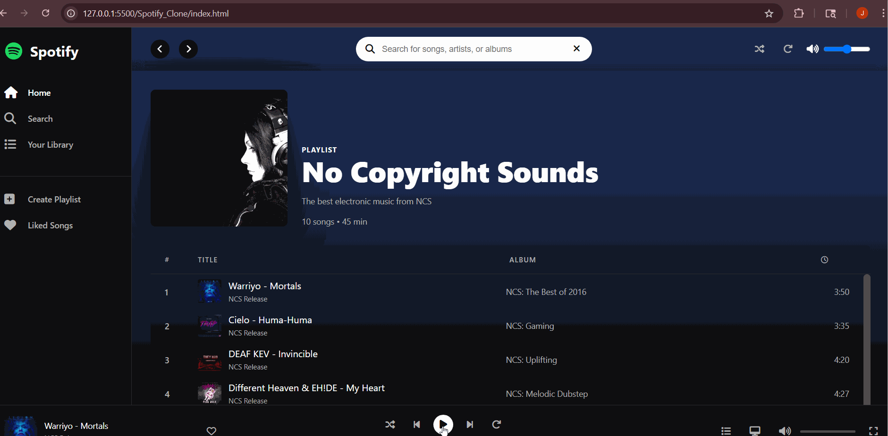

# 🎵 Spotify Clone - Enhanced Music Streaming Experience

A feature-rich, responsive Spotify clone built with modern web technologies. Experience professional music streaming with advanced controls, search functionality, and a pixel-perfect dark theme interface.



   

## ✨ Features

### 🎨 **Modern Interface**

- **Authentic Spotify Design** - Pixel-perfect replica of Spotify's current interface
- **Professional Dark Theme** - Sleek black and green color scheme
- **Glass Morphism Effects** - Modern translucent design elements
- **Smooth Animations** - Elegant hover effects and transitions
- **Responsive Layout** - Adapts seamlessly to all screen sizes

### 🎵 **Music Player**

- **Full Audio Controls** - Play, pause, next, previous functionality
- **Progress Bar** - Seekable timeline with real-time updates
- **Volume Control** - Adjustable volume with mute functionality
- **Shuffle Mode** - Randomize playlist order
- **Repeat Modes** - Off, repeat all, repeat one song
- **Auto-Play** - Automatic progression through playlist

### 🔍 **Advanced Features**

- **Real-time Search** - Filter songs by title, artist, or album
- **Like System** - Heart button to favorite tracks
- **Keyboard Shortcuts** - Power user controls
- **Error Handling** - Graceful audio error management
- **Loading States** - Visual feedback during operations

### 📱 **Responsive Design**

- **Mobile-First Approach** - Optimized for touch devices
- **Adaptive Sidebar** - Collapsible navigation on smaller screens
- **Touch-Friendly Controls** - Proper button sizes and spacing
- **Cross-Device Compatibility** - Works on phones, tablets, and desktops

## 🚀 Getting Started

### Prerequisites

- Modern web browser with HTML5 audio support
- Local web server (recommended for audio file loading)

### Installation

1. **Clone or Download** the project files
2. **Add your music files** to the `songs/` directory (MP3 format)
3. **Add cover images** to the `covers/` directory (JPG format)
4. **Start a local server** and open `index.html`

```bash
# Using Python (if installed)
python -m http.server 8000

# Using Node.js (if installed)
npx serve .

# Or simply open index.html in your browser
```

## 📁 Project Structure

```
Spotify_Clone/
├── index.html          # Main HTML structure
├── style.css           # Complete styling and responsive design
├── script.js           # Enhanced music player functionality
├── songs/              # Audio files directory
│   ├── 1.mp3          # Song files (1-10.mp3)
│   └── ...
├── covers/             # Album cover images
│   ├── 1.jpg          # Cover images (1-10.jpg)
│   └── ...
├── bg.jpg             # Background/playlist cover image
├── logo.png           # Spotify logo
└── README.md          # This documentation
```

## 🎯 Usage

### Basic Controls

- **Play/Pause**: Click the main play button or press `Space`
- **Next/Previous**: Use navigation buttons or `Ctrl + →/←`
- **Volume**: Adjust with volume slider or `Ctrl + ↑/↓`
- **Seek**: Click anywhere on the progress bar
- **Search**: Type in the search box to filter songs

### Advanced Features

- **Shuffle**: Click shuffle button to randomize playlist
- **Repeat**: Click repeat button to cycle through modes
- **Like Songs**: Click heart icon to favorite tracks
- **Play All**: Click the play button on playlist cover

### Keyboard Shortcuts

| Key Combination | Action        |
| --------------- | ------------- |
| `Space`         | Play/Pause    |
| `Ctrl + →`      | Next song     |
| `Ctrl + ←`      | Previous song |
| `Ctrl + ↑`      | Volume up     |
| `Ctrl + ↓`      | Volume down   |

## 🎨 Design Features

### Color Palette

- **Background**: `#121212` (Dark gray)
- **Sidebar**: `#000000` to `#121212` (Black gradient)
- **Primary Green**: `#1db954` (Spotify green)
- **Text Primary**: `#ffffff` (White)
- **Text Secondary**: `#b3b3b3` (Light gray)
- **Accent**: `#1e3264` (Blue gradient)

### Typography

- **Font Family**: Circular Std, system fonts
- **Responsive Text**: Scales with screen size
- **Font Weights**: 300, 400, 500, 600, 700

## 📱 Responsive Breakpoints

- **Desktop**: Default - Full feature set with sidebar
- **Tablet**: ≤ 1024px - Reduced sidebar width
- **Mobile**: ≤ 768px - Hidden sidebar, mobile-optimized layout
- **Small Mobile**: ≤ 480px - Compact controls and spacing

## 🛠️ Technical Details

### Technologies Used

- **HTML5** - Semantic structure with audio element
- **CSS3** - Grid, Flexbox, animations, and responsive design
- **JavaScript (ES6+)** - Class-based architecture with modern features
- **Font Awesome** - Professional icon library

### Architecture

- **Object-Oriented Design** - Clean, maintainable code structure
- **Event-Driven** - Responsive user interactions
- **Modular Functions** - Reusable and testable components
- **Error Handling** - Robust audio and user input management

### Browser Support

- ✅ Chrome 60+
- ✅ Firefox 60+
- ✅ Safari 12+
- ✅ Edge 79+

## 🎵 Music Library

The app comes with 10 sample NCS (No Copyright Sounds) tracks:

1. **Warriyo - Mortals** (NCS Release)
2. **Cielo - Huma-Huma** (NCS Release)
3. **DEAF KEV - Invincible** (NCS Release)
4. **Different Heaven & EH!DE - My Heart** (NCS Release)
5. **Janji - Heroes Tonight** (feat. Johnning)
6. **Rabbin - All of Me** (NCS Release)
7. **Saba - Beautiful Piano Music** (NCS Release)
8. **Syn Cole - Feel Good** (NCS Release)
9. **Tobu - Hope** (NCS Release)
10. **Elektronomia - Sky High** (NCS Release)

## 🔧 Customization

### Adding New Songs

1. Add MP3 files to the `songs/` directory
2. Add corresponding cover images to `covers/` directory
3. Update the song data in `script.js`:

```javascript
{
    id: 11,
    name: "Your Song Title",
    artist: "Artist Name",
    album: "Album Name",
    duration: "3:45",
    filePath: "songs/11.mp3",
    coverPath: "covers/11.jpg"
}
```

### Modifying Colors

Edit CSS custom properties:

```css
:root {
  --spotify-green: #1db954;
  --background-dark: #121212;
  --text-primary: #ffffff;
}
```

### Changing Layout

Modify the CSS Grid structure:

```css
body {
  grid-template-columns: 240px 1fr; /* Sidebar width */
  grid-template-rows: 1fr 90px; /* Player height */
}
```

## 🤝 Contributing

1. Fork the project
2. Create your feature branch (`git checkout -b feature/AmazingFeature`)
3. Commit your changes (`git commit -m 'Add some AmazingFeature'`)
4. Push to the branch (`git push origin feature/AmazingFeature`)
5. Open a Pull Request

## 📄 License

This project is open source and available under the [MIT License](LICENSE).

## 👨‍💻 Author

**Enhanced Spotify Clone**

- Modern web development showcase
- Focus on user experience and performance
- Professional-grade music streaming interface

## 🙏 Acknowledgments

- **Spotify** - Original design inspiration
- **NCS (No Copyright Sounds)** - Sample music tracks
- **Font Awesome** - Professional icon library
- **Modern Web Standards** - HTML5, CSS3, ES6+

---

_Built with ❤️ for music lovers and web developers_
