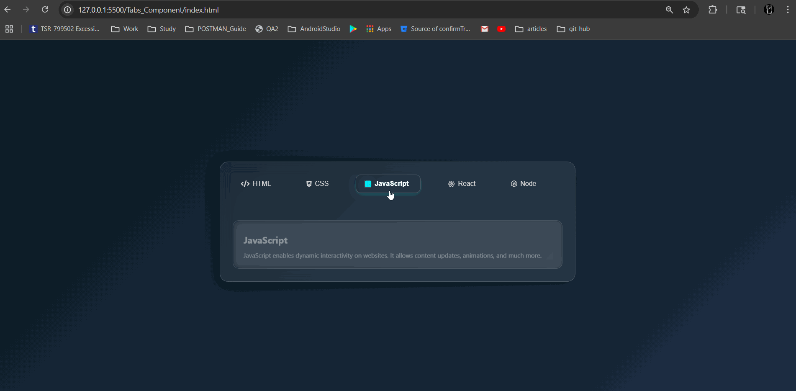

# Glassmorphic Responsive Tabs UI

A professional, fully responsive glassmorphic tabbed interface with:

- Font Awesome icon support
- Animated active tab indicator
- Ripple effect on tab click (Material-style)
- Gradient shimmer animation for icons and labels
- Smooth transitions and clean glass aesthetic

## Features

✅ Fully responsive (mobile, tablet, desktop)  
✅ Tab content switching with animation  
✅ Font Awesome icon integration  
✅ Ripple click animation  
✅ Gradient shimmer effect on active tab  
✅ Glassmorphic background with blur and shadows

## Getting Started

1. Clone or download the project.
2. Open `index.html` in your browser.
3. Ensure internet connection for Font Awesome CDN.

## Folder Structure

```
📁 project-root/
├── index.html
├── style.css
├── script.js
```

## 📸 Preview



## Dependencies

- [Font Awesome](https://cdnjs.com/libraries/font-awesome)
- Modern browser with CSS `backdrop-filter` support

## Author

Built with ❤️ using HTML, CSS, and JavaScript.
