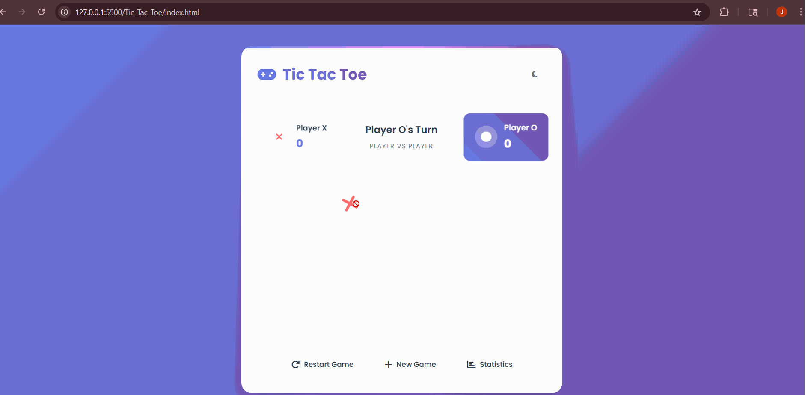

# 🎮 Ultimate Tic Tac Toe Game

A modern, feature-rich Tic Tac Toe game with AI opponents, multiple game modes, and a stunning responsive interface. Built with vanilla JavaScript, CSS3, and HTML5.

   

## 🎯 Preview



### 🖼️ Game Screenshots

#### Game Mode Selection

```
┌─────────────────────────────────────────┐
│  🎮 Tic Tac Toe                    🌙   │
├─────────────────────────────────────────┤
│           Choose Game Mode              │
│                                         │
│  ┌─────────┐ ┌─────────┐ ┌─────────┐   │
│  │ 👥      │ │ 🤖      │ │ 🧠      │   │
│  │Player vs│ │vs AI    │ │vs AI    │   │
│  │Player   │ │(Easy)   │ │(Hard)   │   │
│  │Play with│ │Beginner │ │Unbeatable│  │
│  │a friend │ │level    │ │AI       │   │
│  └─────────┘ └─────────┘ └─────────┘   │
└─────────────────────────────────────────┘
```

#### Game Board Interface

```
┌─────────────────────────────────────────┐
│  Player X: 2    Player X's Turn   AI: 1 │
│  ┌─────┐         vs AI (Hard)    ┌─────┐ │
│  │ ❌  │                         │ ⭕  │ │
│  └─────┘                         └─────┘ │
│                                          │
│         ┌─────┬─────┬─────┐              │
│         │  ❌ │     │  ⭕ │              │
│         ├─────┼─────┼─────┤              │
│         │     │  ❌ │     │              │
│         ├─────┼─────┼─────┤              │
│         │  ⭕ │     │     │              │
│         └─────┴─────┴─────┘              │
│                                          │
│  🔄 Restart  ➕ New Game  📊 Statistics │
└─────────────────────────────────────────┘
```

#### Statistics Modal

```
┌─────────────────────────────────────────┐
│  Game Statistics                    ❌   │
├─────────────────────────────────────────┤
│  ┌─────────┐ ┌─────────┐ ┌─────────┐   │
│  │   15    │ │    8    │ │    5    │   │
│  │ Total   │ │Player X │ │Player O │   │
│  │ Games   │ │  Wins   │ │  Wins   │   │
│  └─────────┘ └─────────┘ └─────────┘   │
│              ┌─────────┐               │
│              │    2    │               │
│              │ Draws   │               │
│              └─────────┘               │
│                                         │
│        🗑️ Reset Statistics             │
└─────────────────────────────────────────┘
```

### 🎨 Theme Variations

#### Light Theme

- **Background**: Purple-blue gradient (`#667eea` → `#764ba2`)
- **Cards**: Clean white with subtle shadows
- **Text**: Dark gray for excellent readability
- **Accents**: Vibrant purple and blue tones

#### Dark Theme

- **Background**: Deep navy gradient (`#1a1a2e` → `#16213e`)
- **Cards**: Dark blue with enhanced shadows
- **Text**: Light gray for comfortable viewing
- **Accents**: Bright purple and cyan highlights

## ✨ Features

### 🎮 **Game Modes**

- **Player vs Player** - Classic two-player local gameplay
- **vs AI (Easy)** - Random move AI perfect for beginners
- **vs AI (Hard)** - Unbeatable Minimax algorithm AI

### 🎨 **Modern Interface**

- **Responsive Design** - Seamless experience on all devices
- **Dark/Light Themes** - Toggle with persistent preference storage
- **Smooth Animations** - CSS3 transitions and keyframe effects
- **Glass Morphism** - Modern translucent design elements
- **Professional Typography** - Poppins font family

### 🧠 **Intelligent AI**

- **Minimax Algorithm** - Mathematically perfect gameplay
- **Difficulty Levels** - Easy (random) and Hard (unbeatable)
- **Natural Timing** - 500ms delay for realistic AI moves
- **Strategic Play** - AI prioritizes wins, blocks losses

### 📊 **Advanced Features**

- **Statistics Tracking** - Persistent game history
- **Score System** - Session-based win tracking
- **Winning Animations** - Dynamic line drawing for victories
- **Keyboard Controls** - Full keyboard navigation support
- **Modal System** - Professional popup interfaces

## 🚀 Getting Started

### Prerequisites

- Modern web browser (Chrome 60+, Firefox 60+, Safari 12+, Edge 79+)
- No additional dependencies required

### Installation

1. **Download** or clone the project files
2. **Open** `index.html` in your web browser
3. **Start playing** immediately!

```bash
# Clone the repository (if using Git)
git clone [your-repo-url]
cd Tic_Tac_Toe

# Open in browser
open index.html
# or double-click the file
```

## 📁 Project Structure

```
Tic_Tac_Toe/
├── index.html          # Main HTML structure
├── style.css           # Complete styling and themes
├── script.js           # Game logic and AI implementation
└── README.md           # This documentation
```

## 🎯 How to Play

### Basic Gameplay

1. **Choose Mode** - Select Player vs Player or AI difficulty
2. **Take Turns** - Click cells to place X or O
3. **Win Condition** - Get three in a row (horizontal, vertical, diagonal)
4. **New Game** - Use controls to restart or change modes

### Game Controls

#### Mouse Controls

- **Click cells** - Place your symbol
- **Click buttons** - Navigate menus and controls
- **Theme toggle** - Switch between light/dark themes

#### Keyboard Shortcuts

| Key      | Action                                    |
| -------- | ----------------------------------------- |
| `1-9`    | Select cells (1=top-left, 9=bottom-right) |
| `R`      | Restart current game                      |
| `S`      | Show statistics                           |
| `Escape` | Close modals                              |

### Cell Numbering

```
1 │ 2 │ 3
──┼───┼──
4 │ 5 │ 6
──┼───┼──
7 │ 8 │ 9
```

## 🛠️ Technical Details

### Technologies Used

- **HTML5** - Semantic structure with accessibility features
- **CSS3** - Grid, Flexbox, animations, and custom properties
- **JavaScript (ES6+)** - Classes, modules, and modern syntax
- **Font Awesome** - Professional icon library
- **Local Storage** - Persistent data storage

### Key Algorithms

- **Minimax Algorithm** - Perfect AI strategy implementation
- **Game State Management** - Efficient board state tracking
- **Win Detection** - Optimized winning combination checking
- **Animation System** - Smooth CSS transition management

### Browser Compatibility

- ✅ Chrome 60+ (Recommended)
- ✅ Firefox 60+
- ✅ Safari 12+
- ✅ Edge 79+
- ✅ Mobile browsers (iOS Safari, Chrome Mobile)

## 🎨 Customization

### Changing Colors

Edit CSS custom properties in `style.css`:

```css
:root {
  --primary-color: #667eea; /* Main theme color */
  --secondary-color: #764ba2; /* Secondary theme color */
  --accent-color: #f093fb; /* Accent highlights */
  --success-color: #4ecdc4; /* Success/win color */
  --danger-color: #ff6b6b; /* Error/loss color */
}
```

### Adding New Themes

Create additional theme variations:

```css
[data-theme="custom"] {
  --bg-primary: #your-color;
  --text-primary: #your-color;
  /* Add your custom colors */
}
```

### Modifying AI Difficulty

Adjust AI behavior in `script.js`:

```javascript
// Add new difficulty level
makeAIMove() {
    let move;
    if (this.gameMode === 'ai-easy') {
        move = this.getRandomMove();
    } else if (this.gameMode === 'ai-medium') {
        move = this.getMediumMove(); // Implement medium difficulty
    } else {
        move = this.getBestMove();
    }
}
```

## 📱 Responsive Design

### Breakpoints

- **Desktop**: Default - Full feature set
- **Tablet**: ≤ 768px - Optimized layout
- **Mobile**: ≤ 480px - Touch-friendly interface

### Mobile Features

- Touch-optimized button sizes
- Simplified navigation
- Vertical layout adaptation
- Gesture-friendly interactions

## 🤝 Contributing

1. Fork the project
2. Create your feature branch (`git checkout -b feature/AmazingFeature`)
3. Commit your changes (`git commit -m 'Add some AmazingFeature'`)
4. Push to the branch (`git push origin feature/AmazingFeature`)
5. Open a Pull Request

## 📄 License

This project is open source and available under the [MIT License](LICENSE).

## 👨‍💻 Author

**Ultimate Tic Tac Toe Game**

- Modern game development showcase
- AI algorithm implementation
- Responsive design excellence

## 🙏 Acknowledgments

- **Minimax Algorithm** - Classic AI game theory
- **Font Awesome** - Professional icon library
- **Google Fonts** - Poppins typography
- **CSS Grid & Flexbox** - Modern layout systems

## 🎮 Game Features Deep Dive

### AI Implementation Details

#### Easy Mode AI

```javascript
// Random move selection
getRandomMove() {
    const availableMoves = this.board
        .map((cell, index) => cell === '' ? index : null)
        .filter(val => val !== null);
    return availableMoves[Math.floor(Math.random() * availableMoves.length)];
}
```

#### Hard Mode AI (Minimax)

```javascript
// Perfect strategy implementation
minimax(board, depth, isMaximizing) {
    const winner = this.checkWinnerForBoard(board);

    if (winner === 'O') return 10 - depth;  // AI wins
    if (winner === 'X') return depth - 10;  // Player wins
    if (this.checkDrawForBoard(board)) return 0;  // Draw

    // Recursive evaluation of all possible moves
    if (isMaximizing) {
        let bestScore = -Infinity;
        for (let i = 0; i < 9; i++) {
            if (board[i] === '') {
                board[i] = 'O';
                let score = this.minimax(board, depth + 1, false);
                board[i] = '';
                bestScore = Math.max(score, bestScore);
            }
        }
        return bestScore;
    } else {
        let bestScore = Infinity;
        for (let i = 0; i < 9; i++) {
            if (board[i] === '') {
                board[i] = 'X';
                let score = this.minimax(board, depth + 1, true);
                board[i] = '';
                bestScore = Math.min(score, bestScore);
            }
        }
        return bestScore;
    }
}
```

### Animation System

#### Winning Line Animation

- **Dynamic Calculation** - Real-time line positioning based on winning cells
- **Smooth Drawing** - CSS transform animations with easing
- **Responsive Scaling** - Adapts to different screen sizes

#### Symbol Animations

```css
@keyframes symbolAppear {
  from {
    opacity: 0;
    transform: scale(0) rotate(180deg);
  }
  to {
    opacity: 1;
    transform: scale(1) rotate(0deg);
  }
}
```

### Statistics System

#### Data Structure

```javascript
gameStats = {
  totalGames: 0,
  playerXWins: 0,
  playerOWins: 0,
  draws: 0,
};
```

#### Persistence

- **Local Storage** - Automatic save/load
- **JSON Serialization** - Efficient data storage
- **Reset Functionality** - Clear statistics option

## 🔧 Advanced Usage

### Extending the Game

#### Adding New Game Modes

1. **Update HTML** - Add new mode button
2. **Modify CSS** - Style the new option
3. **Extend JavaScript** - Implement game logic

```javascript
// Example: Add medium difficulty
selectGameMode(mode) {
    this.gameMode = mode;
    const modeNames = {
        'pvp': 'Player vs Player',
        'ai-easy': 'vs AI (Easy)',
        'ai-medium': 'vs AI (Medium)',  // New mode
        'ai-hard': 'vs AI (Hard)'
    };
    // ... rest of implementation
}
```

#### Custom Themes

Create theme variants by extending CSS variables:

```css
[data-theme="neon"] {
  --primary-color: #00ff88;
  --secondary-color: #0088ff;
  --bg-primary: #000011;
  --text-primary: #00ffff;
}
```

### Performance Optimization

#### Minimax Optimization

- **Alpha-Beta Pruning** - Can be added for faster AI
- **Depth Limiting** - Prevent excessive recursion
- **Memoization** - Cache calculated positions

#### Animation Performance

- **Hardware Acceleration** - Uses `transform` and `opacity`
- **Efficient Selectors** - Optimized CSS selectors
- **Minimal Reflows** - Careful DOM manipulation

## 🐛 Troubleshooting

### Common Issues

#### Game Not Loading

- **Check Console** - Look for JavaScript errors
- **Browser Compatibility** - Ensure modern browser
- **File Paths** - Verify all files are in correct locations

#### AI Not Working

- **JavaScript Enabled** - Ensure JS is not blocked
- **Console Errors** - Check for script errors
- **Mode Selection** - Verify AI mode is properly selected

#### Styles Not Applied

- **CSS Loading** - Check if style.css loads correctly
- **Cache Issues** - Try hard refresh (Ctrl+F5)
- **Font Loading** - Verify Google Fonts connection

### Debug Mode

Add debug logging to track game state:

```javascript
// Add to script.js for debugging
console.log("Current board:", this.board);
console.log("Current player:", this.currentPlayer);
console.log("Game active:", this.gameActive);
```

## 🚀 Deployment

### Local Development

```bash
# Simple HTTP server
python -m http.server 8000
# or
npx serve .
```

### Production Deployment

- **GitHub Pages** - Free static hosting
- **Netlify** - Drag and drop deployment
- **Vercel** - Git-based deployment
- **Any Web Server** - Standard HTML/CSS/JS files

### Build Optimization

For production, consider:

- **Minification** - Compress CSS and JavaScript
- **Image Optimization** - Optimize any images
- **Caching Headers** - Set appropriate cache policies

## 📈 Future Enhancements

### Planned Features

- 🔊 **Sound Effects** - Audio feedback for moves and wins
- 🌐 **Online Multiplayer** - Real-time multiplayer support
- 🏆 **Tournament Mode** - Best-of-series gameplay
- 📱 **PWA Support** - Progressive Web App features
- 🎨 **More Themes** - Additional color schemes
- 📊 **Advanced Stats** - Win streaks, time tracking
- 🤖 **AI Personalities** - Different AI playing styles

### Technical Improvements

- **TypeScript** - Type safety and better development experience
- **Web Components** - Modular, reusable components
- **Service Worker** - Offline functionality
- **WebGL Effects** - Advanced visual effects
- **Touch Gestures** - Swipe and gesture controls

## 📚 Learning Resources

### Game Theory

- **Minimax Algorithm** - Perfect information game strategy
- **Alpha-Beta Pruning** - Optimization technique
- **Game Trees** - Decision tree analysis

### Web Development

- **CSS Grid** - Modern layout system
- **JavaScript Classes** - Object-oriented programming
- **Local Storage** - Browser data persistence
- **Responsive Design** - Multi-device compatibility

---

_Built with ❤️ for game enthusiasts and developers_

**Ready to play? Open `index.html` and challenge the AI!** 🎮🚀
