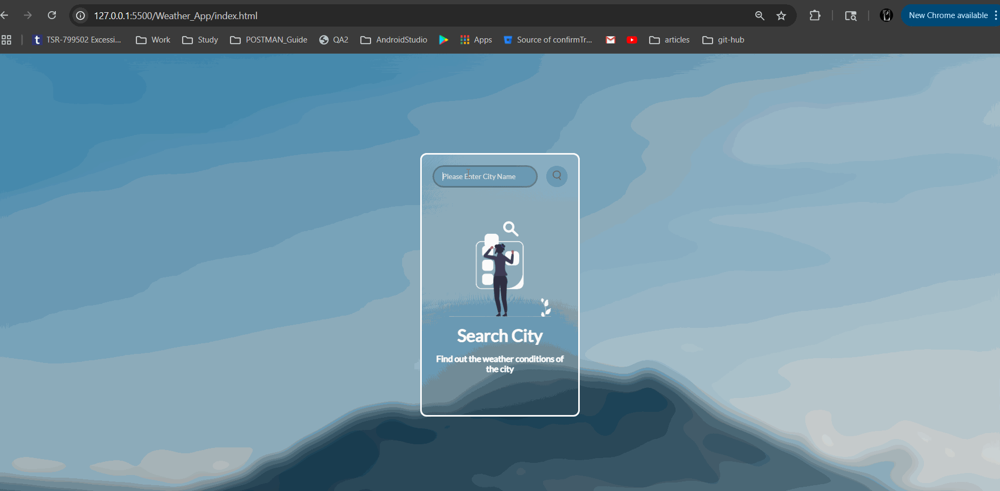

# 🌤️ Responsive Weather App

A beautiful glassmorphic weather application that fetches real-time data using the OpenWeatherMap API and displays it in a clean, user-friendly interface.

## 🔥 Features

- 🔍 City-based search
- 📅 Live weather info: temperature, condition, humidity, wind
- 🗓️ Forecast for upcoming days
- 🌈 Beautiful glassmorphic UI
- ⚙️ Dynamic weather icons based on conditions
- ❌ Not-found & empty-state handling
- 📱 Fully responsive design
- 💨 Smooth UI/UX with hover and scroll effects

## 🛠️ Tech Stack

- HTML5
- CSS3 (Flexbox, Gradients, Custom Scrollbars)
- JavaScript (ES6+, Async/Await, DOM)
- OpenWeatherMap API
- Material Symbols from Google Fonts

## 🚀 Getting Started

1. Clone the repo

   ```bash
   git clone https://github.com/yourusername/weather-app
   ```

2. Add your **OpenWeatherMap API Key** in `script.js`:

   ```js
   const API_KEY = "your_api_key_here";
   ```

3. Open `index.html` in your browser.

## 📸 Preview



## 🙌 Acknowledgements

- [OpenWeatherMap](https://openweathermap.org/)
- [Google Material Symbols](https://fonts.google.com/icons)

---

Made with ❤️ by Pranava Sree Pottipati
