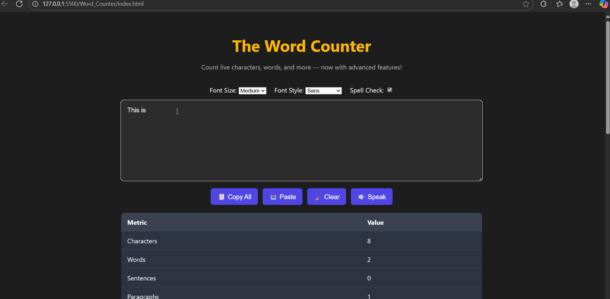

# 📝 Smart Text Editor

A feature-rich web-based Smart Text Editor that enhances productivity and provides insightful analytics.

## 🌐 Live Preview



---

## ✨ Features

### 🔤 Text Formatting

- Change **Font Size**, **Font Family**, and **Font Color**
- Toggle between **Bold**, _Italic_, and Underlined text

### 📊 Live Text Analysis

- Real-time statistics:
  - Word count
  - Character count
  - Sentence count
  - Paragraph count
  - Estimated reading time (WPM)
- Live updates as you type

### 📈 Character Frequency Chart

- Interactive bar chart of most frequent characters
- Built using [Chart.js](https://www.chartjs.org/)

### ⏲️ Pomodoro Timer

- Built-in Pomodoro-style timer with start/reset options
- Session and break management
- Audio alert when the timer ends

### 🌗 Theme Support

- Dark mode UI for a comfortable writing environment

### 🔊 Text-to-Speech (TTS)

- Converts written text into spoken words
- Supports different voices and speeds

### 🌐 Language Translation

- Translate text to other languages using [LibreTranslate API](https://libretranslate.de/)
- Currently supports translation to multiple popular languages

### 🔒 Local Persistence

- Auto-saves the last edited content in localStorage

### 🎯 Writing Streak Tracker

- Daily streak tracking based on word count goal (e.g., 100+ words/day)
- Visual streak indicator
- Resets after inactivity

### ⚙️ Settings Panel

- Customize goals, font, theme, and language preferences

---

## 🚀 How to Run

1. Download the ZIP and extract it.
2. Open `index.html` in a browser.
3. Start writing and enjoy all features instantly—no install needed!

---

## 📁 File Structure

```
smart-text-editor/
│
├── index.html        # Main HTML UI
├── styles.css        # Styles and themes
├── script.js         # Full JavaScript functionality
└── README.md         # You're here!
```

---

## 📌 Credits

- Developed using vanilla **JavaScript**, **HTML5**, and **CSS3**
- Charting by **Chart.js**
- TTS via `SpeechSynthesis` API
